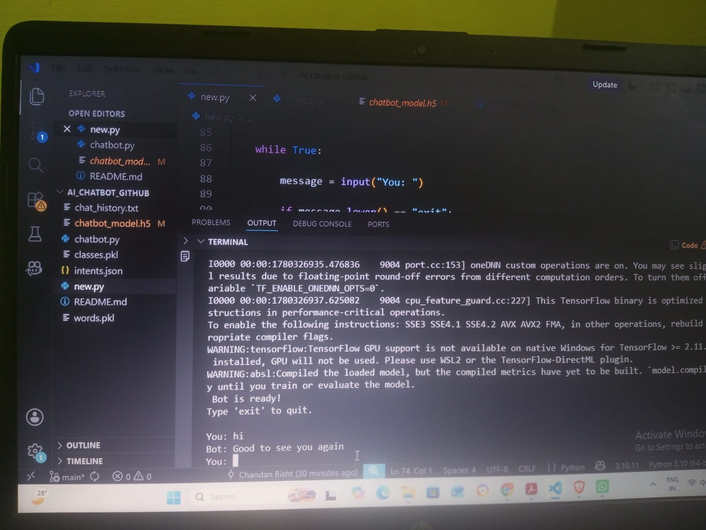
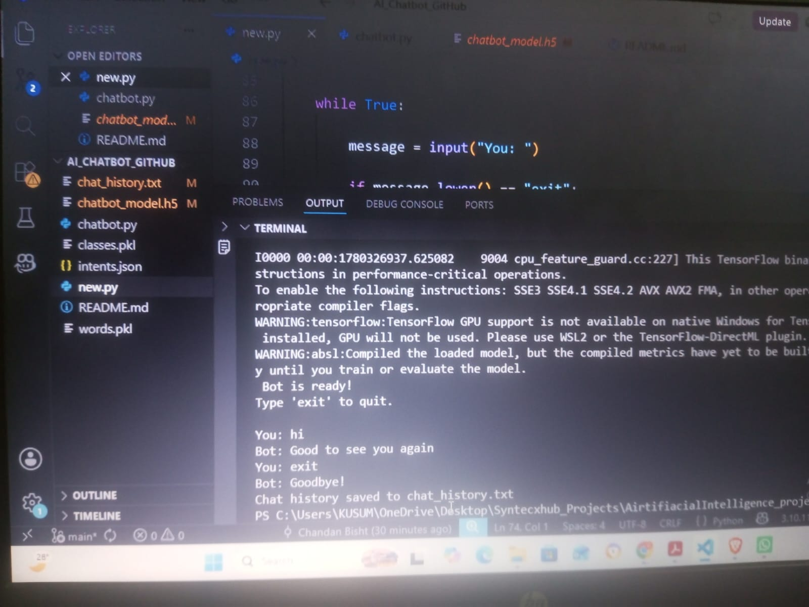
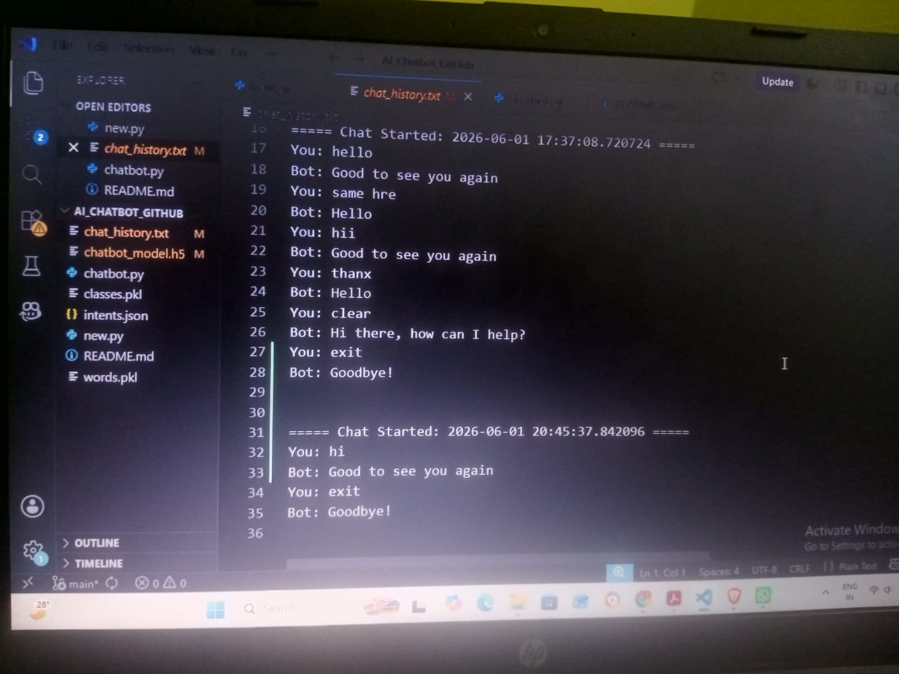
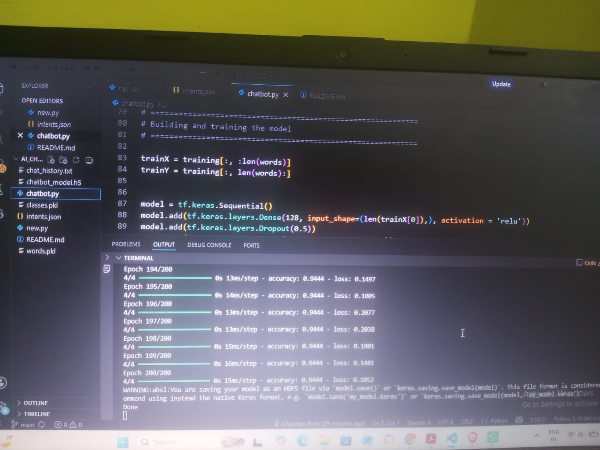

# AI Chatbot using Python, NLTK and TensorFlow

A console-based AI chatbot built using Python, NLTK, and TensorFlow/Keras. The chatbot uses Natural Language Processing (NLP) techniques to classify user intents and generate appropriate responses. It also logs conversation history for future reference.

## Features

* Interactive console-based chatbot
* Intent classification using a trained neural network
* Natural Language Processing (NLTK)
* Text preprocessing with tokenization and lemmatization
* Conversation history logging
* JSON-based intent management
* Easy to customize and extend

## Technologies Used

* Python
* NLTK
* NumPy
* TensorFlow
* Keras
* JSON
* Pickle

## Project Structure

AI_Chatbot_GitHub/

├── new.py

├── intents.json

├── chatbot_model.h5

├── words.pkl

├── classes.pkl

├── requirements.txt

├── README.md

├── .gitignore

└── logs/

    └── chat_history.txt

## Installation

Clone the repository:

git clone https://github.com/Chandan-bt6/AI_Chatbot_GitHub.git

Move into the project directory:

cd AI_Chatbot_GitHub

Install dependencies:

pip install -r requirements.txt

Run the chatbot:

python new.py

## How It Works

1. User enters a message.
2. The text is tokenized and lemmatized.
3. A Bag-of-Words vector is created.
4. The trained neural network predicts the intent.
5. The chatbot selects a response from intents.json.
6. The conversation is saved in the chat history log.

## Future Improvements

* GUI-based chatbot
* Voice assistant integration
* Database storage
* Web deployment using Flask
* Integration with modern LLMs

## Learning Outcomes

This project helped me learn:

* Natural Language Processing fundamentals
* Intent classification
* TensorFlow/Keras model deployment
* Chatbot development
* Git and GitHub workflow
* Conversation logging

## Screenshots

### Chatbot Startup

### Conversation Demo

### Chat History Logging

### Bot Setting Up 

## Author

**Chandan Bisht**

B.Tech Student | Python & AI Enthusiast

GitHub: https://github.com/Chandan-bt6
